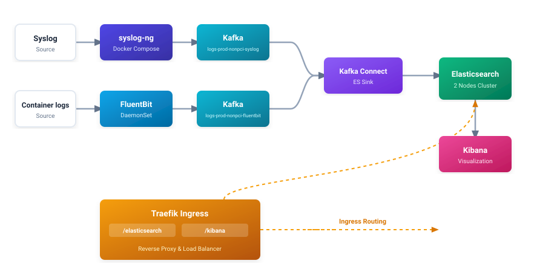
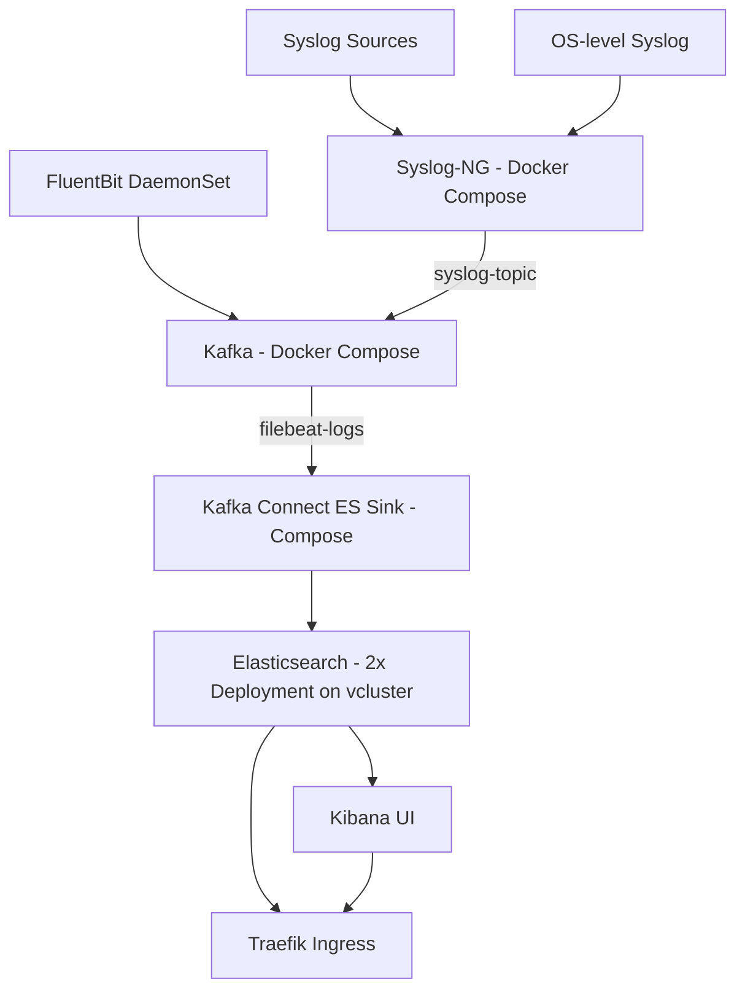

# Elastic Stack Deployment Guide

> **Note:** this guide describes the **current** deployment: a **2-node
> Elasticsearch cluster** running as two Kubernetes `Deployment`s on the
> `my-vc1` vcluster, fronted by Traefik, fed by Kafka (Docker Compose) via a
> Kafka Connect Elasticsearch Sink connector. It supersedes the older
> single-node StatefulSet + security-enabled design.

## Project Overview

Log-analytics pipeline for this repo:




## Architecture Overview



## 1. Prerequisites

- Docker Desktop (or Docker Engine) on the host — the Compose Kafka stack runs here.
- `vcluster` CLI (installed and in PATH).
- `kubectl` configured to target the vcluster after `vcluster create`.
- `sudo` access (the vcluster is created with `sudo` so LoadBalancer-type
  services can allocate addresses).

## 2. Cluster Bootstrap

### 2.1 Create the vcluster (one time)

```bash
make k8s
# equivalent to: sudo vcluster create my-vc1 -f vcluster.yml
```

The vcluster runs 3 worker nodes (`worker-1` .. `worker-3`) with host volumes
`./data/vc1/nN:/data` — **this is where all ES data persists**, so cluster
recreates survive (`make k8s` after a `vcluster delete`).

### 2.2 Label the worker nodes (one time)

```bash
kubectl label node worker-1 worker-2 worker-3 node-role.kubernetes.io/worker=worker
```

See `Deployment/BUILD.md` for the full bootstrap sequence.

## 3. Kafka + syslog-ng (Docker Compose)

Start the supporting infrastructure (broker, schema-registry, control-center,
connect, syslog-ng, rustfs). `make run` also:

- provisions `./data/syslog-ng/config/syslog-ng.conf` from
  `infrastructure/syslog-ng/syslog-ng.conf` (canonical source), and
- creates the Kafka topics (`syslog-topic`, `filebeat-logs`).

```bash
make run
```

> syslog-ng publishes **JSON payloads** (`$(format-json)`) to `syslog-topic` on
> `broker:29092` so the ES sink connector's `JsonConverter` can parse them.

## 4. Deploy the Kubernetes Stack

The single entry point is:

```bash
make deployk8s
```

This performs, in order:

1. **Apply manifests** — `kubectl apply -f k8s/` (files are numbered 00–10 in
   apply order; see `k8s/README.md` for the manifest reference).
2. **Wait for rollouts** — `elasticsearch-1`, `elasticsearch-2` and `kibana`
   Deployments (`kubectl rollout status ... --timeout=300s`).
3. **Configure Elasticsearch + Kibana** — `make elastic-setup`
   (`scripts/configure_elastic.sh`):
   - creates the `logs-ilm` ILM policy (hot 30d / delete 90d),
   - creates the `logs-template` composable index template for `logs-*` /
     `filebeat-*` (`@timestamp` + `ISODATE` as `date` fields, 1 shard / 1
     replica, lifecycle `logs-ilm`),
   - creates Kibana data views: `logs-syslog*` (time field `ISODATE`) and
     `logs-filebeat*` (time field `@timestamp`).
4. **Register the Kafka Connect ES sink connector** — `make sink`
   (`scripts/configure_es_sink.sh`), see §6.

## 5. Elasticsearch (2-node cluster)

Manifest: `k8s/02.elasticsearch.yaml` (+ storage in `k8s/01.elastic_storage.yaml`).

| Node | Deployment | Worker | PVC (hostPath) |
|------|------------|--------|----------------|
| `es-1` | `elasticsearch-1` | `worker-1` | `elasticsearch-data` → `./data/vc1/n1/elasticsearch` |
| `es-2` | `elasticsearch-2` | `worker-2` | `elasticsearch-data-2` → `./data/vc1/n2/elasticsearch-2` |

Key settings:

- Cluster name `k8s-logging`, image `docker.elastic.co/elasticsearch/elasticsearch:8.13.4`.
- Multi-node discovery via the headless service:
  `discovery.seed_hosts: ["elasticsearch-headless"]` +
  `cluster.initial_master_nodes: ["es-1", "es-2"]`.
- Node identity per pod (`node.name` env).
- Java heap `-Xms1g -Xmx1g` (equal values required by the multi-node bootstrap
  check).
- Security **disabled** (`xpack.security.enabled: false`) — homelab only.
- `action.auto_create_index: ".monitoring-*,filebeat-*,logs-*"` — the sink
  connector's `logs-syslog` / `logs-filebeat` indices auto-create.
- The `elasticsearch` Service + Traefik ingress load-balance across both pods;
  the headless `elasticsearch-headless` Service is used for node discovery.

## 6. Kafka → Elasticsearch Sink Connector

Kafka Connect runs as the **Docker Compose `connect` service**
(`georgelza/kafka-connect-custom:3.3` — built with the Confluent
`kafka-connect-elasticsearch` plugin installed, see
`infrastructure/connect/Dockerfile`). Its REST API is published on
`localhost:8083`.

`make sink` (`scripts/configure_es_sink.sh`):

1. Ensures ES is reachable at `localhost:9200` via
   `kubectl port-forward service/elasticsearch 9200:9200 -n elastic`
   (started automatically if not already running). **The forward is left
   running deliberately** (`nohup`, pid in `/tmp/es-pf.pid`) — the sink
   connector needs it continuously, not just while the script runs. Stop with
   `pkill -f "port-forward service/elasticsearch"`.
2. Registers/updates the `elasticsearch-sink` connector (idempotent `PUT
   `/connectors/elasticsearch-sink/config` — note the body is the **raw config
   map**, not the `{"name","config"}` wrapper used by `POST /connectors`):

   | Setting | Value |
   |---------|-------|
   | `connector.class` | `io.confluent.connect.elasticsearch.ElasticsearchSinkConnector` |
   | `topics` | `syslog-topic,filebeat-logs` |
   | `topic.to.external.resource.mapping` | `syslog-topic:logs-syslog, filebeat-logs:logs-filebeat` |
   | `external.resource.usage` | `index` |
   | `connection.url` | `http://host.docker.internal:9200` |
   | `value.converter` | `org.apache.kafka.connect.json.JsonConverter`, `schemas.enable=false` |
   | `key.ignore` / `schema.ignore` | `true` |
   | `index.write.method` | `insert` |

3. Waits for the connector to reach `RUNNING` state.

> **`topic.index.map` vs `topic.to.external.resource.mapping`:** this connector
> version silently ignores the old `topic.index.map` key (it would write to
> topic-named indices like `filebeat-logs`). Use
> `topic.to.external.resource.mapping` **together with**
> `external.resource.usage: index` — the config is rejected unless both are
> set. The connector also validates that the mapped indices exist up-front, so
> `make elastic-setup` (index template) should run before `make sink`.

> **Connect → ES reachability:** ES runs inside the vcluster; the Compose
> `connect` container reaches it through the host via `host.docker.internal`
> pointing at the (persistent) `kubectl port-forward` listener on the host's
> `localhost:9200`.

## 7. Data Flow

| Stream | Source → Kafka topic | ES index (sink) | Kibana data view |
|--------|----------------------|-----------------|------------------|
| Syslog | host/syslog-ng → `syslog-topic` | `logs-syslog` | `logs-syslog*` (time: `@timestamp`) |
| Container logs | FluentBit DaemonSet → `filebeat-logs` | `logs-filebeat` | `logs-filebeat*` (time: `@timestamp`) |

FluentBit resolves the Compose `broker` hostname via `hostAliases` →
`172.20.0.2` (`k8s/05.fluent-bit-daemonset.yaml`) — update that IP if the
Compose bridge network changes.

## 8. Access

### Via Traefik (recommended)

See `Deployment/TRAEFIK.md`.

```bash
kubectl port-forward service/traefik1 -n ingress-traefik1 8080:80
# Kibana:      http://localhost:8080/kibana
# ES REST API: http://localhost:8080/elasticsearch/_cluster/health?pretty
```

### Direct port-forwards

```bash
kubectl port-forward service/elasticsearch 9200:9200 -n elastic   # ES
kubectl port-forward service/kibana 5601:5601 -n elastic          # Kibana (browse /kibana)
kubectl port-forward service/traefik1 -n ingress-traefik1 8080:80 # Traefik
```

## 9. Validation

```bash
# ES cluster (2 nodes, green)
curl -s localhost:9200/_cluster/health?pretty
curl -s localhost:9200/_cat/nodes?v

# Indices from the sink connector
curl -s localhost:9200/_cat/indices/logs-*?v

# Sink connector state
curl -s localhost:8083/connectors/elasticsearch-sink/status | python3 -m json.tool

# Kibana data views
curl -s 'localhost:5601/kibana/api/saved_objects/_find?type=index-pattern&fields=title'
```

## 10. Troubleshooting

- **No documents in `logs-filebeat` / `logs-syslog`**:
  1. `make sink` — is the connector `RUNNING`?
  2. Are messages on the topics? `docker compose -p elastic exec broker kafka-console-consumer --bootstrap-server localhost:9092 --topic filebeat-logs --from-beginning --max-messages 5`
  3. Is the port-forward alive while the connector runs? (Restarting it
     mid-flight breaks the connection; re-run `make sink` afterwards.)
  4. FluentBit broker IP drift — re-check `kubectl get pod -n elastic -o wide` +
     the compose bridge IP (`docker network inspect elastic_default`).
- **syslog-ng not forwarding**: ensure `bootstrap_servers("broker:29092")` in
  `infrastructure/syslog-ng/syslog-ng.conf` and re-run `make run` to
  re-provision; check `docker compose -p elastic logs syslog-ng`.
- **ES pods crash-looping after vcluster recreate**: PVs/PVCs persist under
  `./data/vc1/nN/`; if the underlying hostPath permissions changed, re-apply
  `k8s/` and check the fix-data-permissions init container logs.

## 11. Cleanup

```bash
make down                       # tear down the Compose stack (+ ./data)
vcluster delete my-vc1          # tear down the vcluster
```

## 12. Related Documents

- `Deployment/TRAEFIK.md` — ingress layer
- `Deployment/DEPLOY_SYSLOG.md` — syslog collector configuration
- `k8s/README.md` — manifest-by-manifest reference and apply order
- `Todo.md` — task tracking
