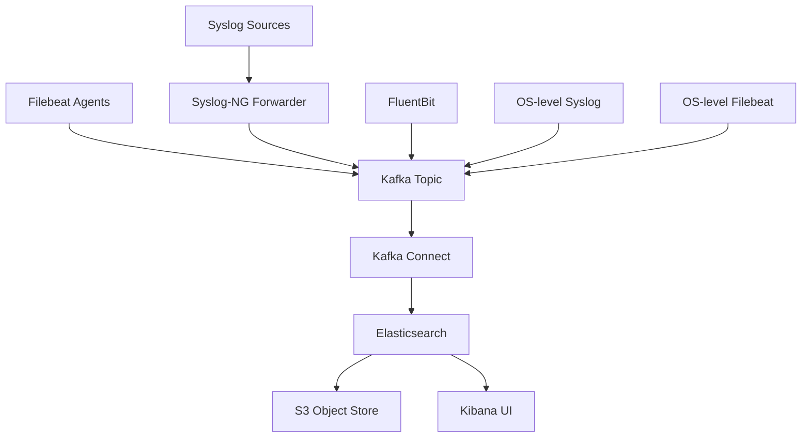

# Elastic Stack Deployment Guide

## Project Overview

This document provides a comprehensive guide to deploy an Elastic stack for log analytics on Kubernetes. The setup includes Elasticsearch, Kibana, Filebeat, Syslog and Syslog-ng configuration, with integration to Kafka for log routing.

## Architecture Overview



## 1. Namespace Setup

All components will be deployed in the `elastic` namespace.

### 1.1 Create Elastic Namespace

**File: `elastic-namespace.yaml`**

```yaml
apiVersion: v1
kind: Namespace
metadata:
  name: elastic
  labels:
    name: elastic
```

### 1.2 Apply Namespace

```bash
kubectl apply -f elastic-namespace.yaml
```

## 2. Elasticsearch Setup

### 2.1 Elasticsearch Configuration

**File: `elasticsearch-config.yaml`**

```yaml
apiVersion: v1
kind: ConfigMap
metadata:
  name: elasticsearch-config
  namespace: elastic
data:
  elasticsearch.yml: |
    cluster.name: "elastic-cluster"
    node.name: "elasticsearch-master"
    network.host: 0.0.0.0
    discovery.type: single-node
    # Security settings
    xpack.security.enabled: true
    xpack.security.transport.ssl.enabled: true
    xpack.security.transport.ssl.verification_mode: certificate
    xpack.security.transport.ssl.keystore.path: certs/elastic-certificates.p12
    xpack.security.transport.ssl.truststore.path: certs/elastic-certificates.p12
    xpack.security.http.ssl.enabled: true
    xpack.security.http.ssl.keystore.path: certs/elastic-certificates.p12
    xpack.security.http.ssl.truststore.path: certs/elastic-certificates.p12
    # Storage settings
    path.data: /usr/share/elasticsearch/data
    path.logs: /usr/share/elasticsearch/logs
    # Performance settings
    indices.memory.index_buffer_size: 25%
    indices.fielddata.cache.size: 25%
    index.codec: best_compression
```

### 2.2 Elasticsearch StatefulSet

**File: `elasticsearch-statefulset.yaml`**

```yaml
apiVersion: apps/v1
kind: StatefulSet
metadata:
  name: elasticsearch
  namespace: elastic
  labels:
    app: elasticsearch
spec:
  serviceName: elasticsearch
  replicas: 3
  selector:
    matchLabels:
      app: elasticsearch
  template:
    metadata:
      labels:
        app: elasticsearch
    spec:
      containers:
      - name: elasticsearch
        image: docker.elastic.co/elasticsearch/elasticsearch:8.11.3
        env:
        - name: discovery.type
          value: "single-node"
        - name: ES_JAVA_OPTS
          value: "-Xms1g -Xmx1g"
        - name: ELASTIC_USERNAME
          value: "elastic"
        - name: ELASTIC_PASSWORD
          value: "changeme"
        ports:
        - containerPort: 9200
          name: http
        - containerPort: 9300
          name: transport
        volumeMounts:
        - name: elasticsearch-data
          mountPath: /usr/share/elasticsearch/data
        - name: elasticsearch-config
          mountPath: /usr/share/elasticsearch/config/elasticsearch.yml
          subPath: elasticsearch.yml
      volumes:
      - name: elasticsearch-config
        configMap:
          name: elasticsearch-config
      - name: elasticsearch-data
        persistentVolumeClaim:
          claimName: elasticsearch-data
  volumeClaimTemplates:
  - metadata:
      name: elasticsearch-data
    spec:
      accessModes: [ "ReadWriteOnce" ]
      resources:
        requests:
          storage: 20Gi
```

### 2.3 Elasticsearch Service

**File: `elasticsearch-service.yaml`**

```yaml
apiVersion: v1
kind: Service
metadata:
  name: elasticsearch
  namespace: elastic
  labels:
    app: elasticsearch
spec:
  ports:
  - port: 9200
    name: http
  - port: 9300
    name: transport
  selector:
    app: elasticsearch
```

### 2.4 Elasticsearch Headless Service

**File: `elasticsearch-headless-service.yaml`**

```yaml
apiVersion: v1
kind: Service
metadata:
  name: elasticsearch-headless
  namespace: elastic
  labels:
    app: elasticsearch
spec:
  clusterIP: None
  ports:
  - port: 9200
    name: http
  - port: 9300
    name: transport
  selector:
    app: elasticsearch
```

### 2.5 Elasticsearch Storage

**File: `elasticsearch-pv.yaml`**

```yaml
apiVersion: v1
kind: PersistentVolume
metadata:
  name: elasticsearch-pv
  labels:
    type: local
spec:
  storageClassName: manual
  capacity:
    storage: 50Gi
  accessModes:
    - ReadWriteOnce
  hostPath:
    path: "/mnt/data/elasticsearch"
---
apiVersion: v1
kind: PersistentVolumeClaim
metadata:
  name: elasticsearch-data
  namespace: elastic
spec:
  accessModes:
    - ReadWriteOnce
  resources:
    requests:
      storage: 20Gi
```

## 3. Kibana Setup

### 3.1 Kibana Configuration

**File: `kibana-config.yaml`**

```yaml
apiVersion: v1
kind: ConfigMap
metadata:
  name: kibana-config
  namespace: elastic
data:
  kibana.yml: |
    server.name: kibana
    server.host: "0.0.0.0"
    elasticsearch.hosts: [ "http://elasticsearch:9200" ]
    # Security settings
    xpack.security.enabled: true
    # Logging
    logging.dest: stdout
    logging.level: info
```

### 3.2 Kibana Deployment

**File: `kibana-deployment.yaml`**

```yaml
apiVersion: apps/v1
kind: Deployment
metadata:
  name: kibana
  namespace: elastic
  labels:
    app: kibana
spec:
  replicas: 2
  selector:
    matchLabels:
      app: kibana
  template:
    metadata:
      labels:
        app: kibana
    spec:
      containers:
      - name: kibana
        image: docker.elastic.co/kibana/kibana:8.11.3
        resources:
          requests:
            memory: "1Gi"
            cpu: "500m"
          limits:
            memory: "2Gi"
            cpu: "1"
        ports:
        - containerPort: 5601
        volumeMounts:
        - name: kibana-config
          mountPath: /usr/share/kibana/config/kibana.yml
          subPath: kibana.yml
      volumes:
      - name: kibana-config
        configMap:
          name: kibana-config
```

### 3.3 Kibana Service

**File: `kibana-service.yaml`**

```yaml
apiVersion: v1
kind: Service
metadata:
  name: kibana
  namespace: elastic
  labels:
    app: kibana
spec:
  ports:
  - port: 5601
    name: web
  selector:
    app: kibana
```

## 4. Filebeat Setup

### 4.1 Filebeat DaemonSet

**File: `filebeat-daemonset.yaml`**

```yaml
apiVersion: apps/v1
kind: DaemonSet
metadata:
  name: filebeat
  namespace: elastic
  labels:
    app: filebeat
spec:
  selector:
    matchLabels:
      app: filebeat
  template:
    metadata:
      labels:
        app: filebeat
    spec:
      serviceAccountName: filebeat
      containers:
      - name: filebeat
        image: docker.elastic.co/beats/filebeat:8.11.3
        resources:
          requests:
            memory: "128Mi"
            cpu: "100m"
          limits:
            memory: "256Mi"
            cpu: "200m"
        volumeMounts:
        - name: filebeat-config
          mountPath: /etc/filebeat/filebeat.yml
          subPath: filebeat.yml
        - name: data
          mountPath: /usr/share/filebeat/data
        - name: var-log
          mountPath: /var/log
          readOnly: true
        - name: var-lib
          mountPath: /var/lib
          readOnly: true
        - name: proc
          mountPath: /proc
          readOnly: true
        - name: cgroup
          mountPath: /sys/fs/cgroup
          readOnly: true
      volumes:
      - name: filebeat-config
        configMap:
          name: filebeat-config
      - name: data
        hostPath:
          path: /var/lib/filebeat
          type: DirectoryOrCreate
      - name: var-log
        hostPath:
          path: /var/log
      - name: var-lib
        hostPath:
          path: /var/lib
      - name: proc
        hostPath:
          path: /proc
      - name: cgroup
        hostPath:
          path: /sys/fs/cgroup
---
apiVersion: v1
kind: ServiceAccount
metadata:
  name: filebeat
  namespace: elastic
---
apiVersion: rbac.authorization.k8s.io/v1
kind: ClusterRole
metadata:
  name: filebeat
rules:
- apiGroups: [""]
  resources: ["nodes", "namespaces", "pods"]
  verbs: ["get", "watch", "list"]
---
apiVersion: rbac.authorization.k8s.io/v1
kind: ClusterRoleBinding
metadata:
  name: filebeat
subjects:
- kind: ServiceAccount
  name: filebeat
  namespace: elastic
roleRef:
  kind: ClusterRole
  name: filebeat
  apiGroup: rbac.authorization.k8s.io
```

### 4.2 Filebeat Configuration

**File: `filebeat-config.yaml`**

```yaml
apiVersion: v1
kind: ConfigMap
metadata:
  name: filebeat-config
  namespace: elastic
data:
  filebeat.yml: |
    filebeat.inputs:
    - type: log
      enabled: true
      paths:
        - /var/log/*.log
      fields:
        service: "kubernetes"
      fields_under_root: true
      json:
        keys_under_root: true
        overwrite_keys: true
        add_error_key: true

    output.elasticsearch:
      hosts: ["http://elasticsearch:9200"]
      username: elastic
      password: changeme
      index: "filebeat-%{+yyyy.MM.dd}"
    setup.template.enabled: false
    setup.ilm.enabled: false
```

## 5. Syslog and Syslog-ng Setup

### 5.1 Syslog-NG DaemonSet for Local Collection

**File: `syslog-ng-daemonset.yaml`**

```yaml
apiVersion: apps/v1
kind: DaemonSet
metadata:
  name: syslog-ng
  namespace: elastic
  labels:
    app: syslog-ng
spec:
  selector:
    matchLabels:
      app: syslog-ng
  template:
    metadata:
      labels:
        app: syslog-ng
    spec:
      containers:
      - name: syslog-ng
        image: syslog-ng/syslog-ng:latest
        resources:
          requests:
            memory: "128Mi"
            cpu: "100m"
          limits:
            memory: "256Mi"
            cpu: "200m"
        ports:
        - containerPort: 514
          name: syslog
        volumeMounts:
        - name: syslog-ng-config
          mountPath: /etc/syslog-ng/syslog-ng.conf
          subPath: syslog-ng.conf
        - name: var-log
          mountPath: /var/log
          readOnly: true
        - name: logs
          mountPath: /var/log/syslog-ng  
      volumes:
      - name: syslog-ng-config
        configMap:
          name: syslog-ng-config
      - name: var-log
        hostPath:
          path: /var/log
      - name: logs
        hostPath:
          path: /var/log/syslog-ng
---
apiVersion: v1
kind: ConfigMap
metadata:
  name: syslog-ng-config
  namespace: elastic
data:
  syslog-ng.conf: |
    @version: 3.28
    
    # Global options
    options {
        time-stamp(follow_system_tz(no));
        timestamp_format("%Y-%m-%dT%H:%M:%S.%NZ");
        log_msg_size(65536);
    };
    
    # Syslog input
    source s_syslog {
        system();
        internal();
    };
    
    # Kafka output
    destination d_kafka {
        kafka(
            bootstrap_servers("connect:8083")
            topic("syslog-topic")
            key("syslog")
        );
    };
    
    # Log path
    log {
        source(s_syslog);
        destination(d_kafka);
    };
```

### 5.2 Syslog Server with Kafka Forwarding

**File: `syslog-server.yaml`**

```yaml
apiVersion: apps/v1
kind: Deployment
metadata:
  name: syslog-server
  namespace: elastic
  labels:
    app: syslog-server
spec:
  replicas: 2
  selector:
    matchLabels:
      app: syslog-server
  template:
    metadata:
      labels:
        app: syslog-server
    spec:
      containers:
      - name: syslog-server
        image: linuxserver/syslog-ng:latest
        ports:
        - containerPort: 514
          name: syslog
        - containerPort: 514
          name: syslog-tcp
          protocol: TCP
        env:
        - name: PUID
          value: "1000"
        - name: PGID
          value: "1000"
        volumeMounts:
        - name: syslog-config
          mountPath: /config
        - name: logs
          mountPath: /logs
      volumes:
      - name: syslog-config
        emptyDir: {}
      - name: logs
        emptyDir: {}
---
apiVersion: v1
kind: Service
metadata:
  name: syslog-server
  namespace: elastic
  labels:
    app: syslog-server
spec:
  ports:
  - port: 514
    name: syslog
  - port: 514
    name: syslog-tcp
    protocol: TCP
  selector:
    app: syslog-server
```

## 6. Kafka Connect Setup for Elasticsearch Sink

### 6.1 Kafka Connect Configuration

**File: `kafka-connect-deployment.yaml`**

```yaml
apiVersion: apps/v1
kind: Deployment
metadata:
  name: kafka-connect
  namespace: elastic
  labels:
    app: kafka-connect
spec:
  replicas: 2
  selector:
    matchLabels:
      app: kafka-connect
  template:
    metadata:
      labels:
        app: kafka-connect
    spec:
      containers:
      - name: kafka-connect
        image: confluentinc/cp-kafka-connect:7.9.6
        ports:
        - containerPort: 8083
          name: rest
        env:
        - name: CONNECT_BOOTSTRAP_SERVERS
          value: "broker:29092"
        - name: CONNECT_REST_ADVERTISED_HOST_NAME
          value: "connect"
        - name: CONNECT_GROUP_ID
          value: "connect-cluster"
        - name: CONNECT_CONFIG_STORAGE_TOPIC
          value: "connect-configs"
        - name: CONNECT_OFFSET_STORAGE_TOPIC
          value: "connect-offsets"
        - name: CONNECT_STATUS_STORAGE_TOPIC
          value: "connect-status"
        - name: CONNECT_KEY_CONVERTER
          value: "org.apache.kafka.connect.json.JsonConverter"
        - name: CONNECT_VALUE_CONVERTER
          value: "org.apache.kafka.connect.json.JsonConverter"
        - name: CONNECT_INTERNAL_KEY_CONVERTER
          value: "org.apache.kafka.connect.json.JsonConverter"
        - name: CONNECT_INTERNAL_VALUE_CONVERTER
          value: "org.apache.kafka.connect.json.JsonConverter"
        resources:
          requests:
            memory: "1Gi"
            cpu: "500m"
          limits:
            memory: "2Gi"
            cpu: "1"
```

### 6.2 Elasticsearch Sink Connector Configuration

**File: `elasticsearch-sink-connector.yaml`**

```yaml
apiVersion: v1
kind: ConfigMap
metadata:
  name: elasticsearch-sink-config
  namespace: elastic
data:
  connector.properties: |
    name=elasticsearch-sink
    connector.class=io.confluent.connect.elasticsearch.ElasticsearchSinkConnector
    tasks.max=1
    connection.url=http://elasticsearch:9200
    type.name=doc
    key.ignore=true
    schema.ignore=true
    behavior.on.malformed.documents=skip
    topics=syslog-topic
    flush.timeout.ms=5000
```

## 7. S3 Tiered Storage with RustFS

### 7.1 RustFS Deployment

**File: `rustfs-deployment.yaml`**

```yaml
apiVersion: apps/v1
kind: Deployment
metadata:
  name: rustfs
  namespace: elastic
  labels:
    app: rustfs
spec:
  replicas: 1
  selector:
    matchLabels:
      app: rustfs
  template:
    metadata:
      labels:
        app: rustfs
    spec:
      containers:
      - name: rustfs
        image: rustfs/rustfs:latest
        ports:
        - containerPort: 8080
        env:
        - name: RUSTFS_S3_BUCKET
          value: "elastic-logs-bucket"
        - name: RUSTFS_S3_REGION
          value: "us-east-1"
        resources:
          requests:
            memory: "256Mi"
            cpu: "200m"
          limits:
            memory: "512Mi"
            cpu: "500m"
```

### 7.2 RustFS Service

**File: `rustfs-service.yaml`**

```yaml
apiVersion: v1
kind: Service
metadata:
  name: rustfs
  namespace: elastic
  labels:
    app: rustfs
spec:
  ports:
  - port: 8080
    name: http
  selector:
    app: rustfs
```

## 8. Deployment Sequence

### 8.1 Deploy Core Infrastructure

```bash
# 1. Create namespace
kubectl apply -f elastic-namespace.yaml

# 2. Deploy storage (if needed)
kubectl apply -f elasticsearch-pv.yaml

# 3. Deploy Elasticsearch
kubectl apply -f elasticsearch-config.yaml
kubectl apply -f elasticsearch-statefulset.yaml
kubectl apply -f elasticsearch-service.yaml
kubectl apply -f elasticsearch-headless-service.yaml

# 4. Deploy Kibana
kubectl apply -f kibana-config.yaml
kubectl apply -f kibana-deployment.yaml
kubectl apply -f kibana-service.yaml

# 5. Deploy Filebeat
kubectl apply -f filebeat-config.yaml
kubectl apply -f filebeat-daemonset.yaml

# 6. Deploy Syslog-NG
kubectl apply -f syslog-ng-daemonset.yaml
kubectl apply -f syslog-server.yaml

# 7. Deploy Kafka Connect
kubectl apply -f kafka-connect-deployment.yaml
kubectl apply -f elasticsearch-sink-connector.yaml

# 8. Deploy RustFS
kubectl apply -f rustfs-deployment.yaml
kubectl apply -f rustfs-service.yaml
```

### 8.2 Wait for Deployment Completion

```bash
# Wait for pods to be ready
kubectl get pods -n elastic

# Check status
kubectl rollout status deployment/elasticsearch -n elastic
kubectl rollout status deployment/kibana -n elastic
kubectl rollout status daemonset/filebeat -n elastic
```

## 9. Configuration Setup

### 9.1 Elasticsearch Security Setup

```bash
# Initialize security settings (run once)
kubectl exec -it elasticsearch-0 -n elastic -- elasticsearch-setup-passwords auto
```

### 9.2 Kibana Index Pattern Setup

After Kibana is deployed, create index patterns through the web interface:
1. Go to Kibana UI (port 5601)
2. Navigate to "Stack Management" → "Index Patterns"
3. Create patterns for filebeat, syslog, etc.

## 10. Monitoring and Validation

### 10.1 Validate Elasticsearch Cluster

```bash
# Check cluster health
kubectl exec -it elasticsearch-0 -n elastic -- curl -u elastic:passwd http://localhost:9200/_cluster/health?pretty

# Check nodes
kubectl exec -it elasticsearch-0 -n elastic -- curl -u elastic:passwd http://localhost:9200/_cat/nodes?v
```

### 10.2 Validate Kibana Service

```bash
# Port forward to access Kibana
kubectl port-forward svc/kibana 5601:5601 -n elastic
```

## 11. AWS Integration Notes

### 11.1 MSK Configuration

For integration with AWS MSK:
1. Deploy required Kafka clients and connect:
2. Configure proper security settings
3. Set up appropriate IAM roles

### 11.2 S3 Configuration

```yaml
# S3 connection for persistent storage in Elasticsearch
elasticsearch.yml:
  # Add storage configuration
  xpack.ml.enabled: false
  xpack.remote_cluster.enabled: false
  # Tiered storage configuration
  index.store.type: fs
```

## 12. Scaling Recommendations

1. For production:
   - Elasticsearch: Scale to 3+ nodes with proper disk configuration
   - Kibana: Deploy with 2+ replicas
   - Filebeat: DaemonSet ensures coverage for all nodes
   - Syslog-ng: Deploy with appropriate HA configuration

2. Resource Requirements:
   - Elasticsearch: 2GB RAM, 2 vCPU per node
   - Kibana: 1GB RAM, 1 vCPU
   - Filebeat: Minimal CPU/Memory (128MB RAM)
   - Kafka Connect: 1GB RAM, 1 vCPU

## 13. Security Considerations

- Enable authentication and TLS for Elasticsearch
- Regularly rotate passwords
- Implement proper RBAC for Kibana
- Secure Kubernetes cluster access
- Network policies to limit connectivity

## 14. Troubleshooting Tips

1. **Elasticsearch not starting**: Check logs with `kubectl logs <pod-name> -n elastic`
2. **Kibana not accessible**: Check service status with `kubectl get svc kibana -n elastic`
3. **Filebeat issues**: Ensure proper permissions on log directories
4. **Log duplicates**: Check Kafka configuration for idempotency settings

## 15. Cleanup Commands

```bash
# Remove all elastic components
kubectl delete ns elastic

# Remove PV if no longer needed
kubectl delete pv elasticsearch-pv
```

This deployment guide provides a complete foundation for running an Elastic Stack on Kubernetes with support for log analytics, fall back storage options, and integration capabilities with existing infrastructure.# Elastic Stack Deployment Plan

## Executive Summary

This comprehensive document outlines a deployment strategy for the Elastic Stack including Elasticsearch, Kibana, Filebeat, Syslog and Syslog-ng integration, with a focus on standardizing on the "elastic" namespace for all Elastic components.

## Architecture Overview

### Core Architecture


## Deployment Components

### 1. Namespace Standardization

All Elastic components are deployed in the `elastic` namespace for consistency:

```yaml
---
apiVersion: v1
kind: Namespace
metadata:
  name: elastic
```

### 2. Elasticsearch Deployment

#### Configuration:

- Single node discovery for development
- Resource limits (2Gi memory, 1 CPU) 
- Persistent storage via PVC
- VM map count configuration (262144)

#### Example Deployment:

```yaml
---
# Elasticsearch ConfigMap
apiVersion: v1
kind: ConfigMap
metadata:
  name: elasticsearch-config
  namespace: elastic
data:
  elasticsearch.yml: |
    cluster.name: "k8s-logging"
    network.host: 0.0.0.0
    discovery.type: single-node
    xpack.security.enabled: false
    xpack.monitoring.collection.enabled: true

---
# Elasticsearch Deployment  
apiVersion: apps/v1
kind: Deployment
metadata:
  name: elasticsearch
  namespace: elastic
  labels:
    app: elasticsearch
spec:
  replicas: 1
  selector:
    matchLabels:
      app: elasticsearch
  strategy:
    type: Recreate
  template:
    metadata:
      labels:
        app: elasticsearch
    spec:
      initContainers:
        - name: sysctl
          image: busybox:1.36
          command: ["sysctl", "-w", "vm.max_map_count=262144"]
          securityContext:
            privileged: true
      containers:
        - name: elasticsearch
          image: docker.elastic.co/elasticsearch/elasticsearch:8.13.4
          resources:
            requests:
              memory: "1Gi"
              cpu: "500m"
            limits:
              memory: "2Gi"
              cpu: "1000m"
          env:
            - name: ES_JAVA_OPTS
              value: "-Xms512m -Xmx1g"
          ports:
            - containerPort: 9200
              name: http
            - containerPort: 9300
              name: transport
          readinessProbe:
            httpGet:
              path: /_cluster/health?local=true
              port: 9200
            initialDelaySeconds: 30
          livenessProbe:
            httpGet:
              path: /_cluster/health?local=true
              port: 9200
            initialDelaySeconds: 60
          volumeMounts:
            - name: data
              mountPath: /usr/share/elasticsearch/data
            - name: config
              mountPath: /usr/share/elasticsearch/config/elasticsearch.yml
              subPath: elasticsearch.yml
      volumes:
        - name: data
          persistentVolumeClaim:
            claimName: elasticsearch-pvc
        - name: config
          configMap:
            name: elasticsearch-config
```

### 3. Kibana Deployment

#### Configuration:

- HTTP port 5601
- Base path for reverse proxy support (`/kibana`)
- Connection to Elasticsearch service
- Resource constraints (1Gi memory, 500m CPU)

#### Example Deployment:

```yaml
---
# Kibana ConfigMap
apiVersion: v1  
kind: ConfigMap
metadata:
  name: kibana-config
  namespace: elastic
data:
  kibana.yml: |
    server.name: kibana
    server.host: "0.0.0.0"
    server.basePath: "/kibana"
    server.rewriteBasePath: true
    elasticsearch.hosts: ["http://elasticsearch.elastic.svc.cluster.local:9200"]

---
# Kibana Deployment
apiVersion: apps/v1
kind: Deployment
metadata:
  name: kibana
  namespace: elastic
  labels:
    app: kibana
spec:
  replicas: 1
  selector:
    matchLabels:
      app: kibana
  template:
    metadata:
      labels:
        app: kibana
    spec:
      containers:
        - name: kibana
          image: docker.elastic.co/kibana/kibana:8.13.4
          resources:
            requests:
              memory: "512Mi"
              cpu: "250m"
            limits:
              memory: "1Gi"
              cpu: "500m"
          ports:
            - containerPort: 5601
              name: http
          readinessProbe:
            httpGet:
              path: /kibana/api/status
              port: 5601
            initialDelaySeconds: 60
          livenessProbe:
            httpGet:
              path: /kibana/api/status
              port: 5601
            initialDelaySeconds: 120
          volumeMounts:
            - name: config
              mountPath: /usr/share/kibana/config/kibana.yml
              subPath: kibana.yml
      volumes:
        - name: config
          configMap:
            name: kibana-config

---
# Kibana Service
apiVersion: v1
kind: Service
metadata:
  name: kibana
  namespace: elastic
  labels:
    app: kibana
spec:
  type: ClusterIP
  selector:
    app: kibana
  ports:
    - name: http
      port: 5601
      targetPort: 5601
```

### 4. Filebeat DaemonSet Deployment

Filebeat is deployed as a DaemonSet to collect logs from all nodes in the cluster.

#### Example Deployment:

```yaml
---
# Filebeat RBAC
apiVersion: v1
kind: ServiceAccount
metadata:
  name: filebeat
  namespace: elastic

---
apiVersion: rbac.authorization.k8s.io/v1
kind: ClusterRole
metadata:
  name: filebeat
rules:
  - apiGroups: [""]
    resources: [namespaces, pods, nodes]
    verbs: [get, watch, list]
  - apiGroups: [apps]
    resources: [replicasets]
    verbs: [get, watch, list]
  - apiGroups: [batch]
    resources: [jobs]
    verbs: [get, watch, list]

---
apiVersion: rbac.authorization.k8s.io/v1
kind: ClusterRoleBinding
metadata:
  name: filebeat
subjects:
  - kind: ServiceAccount
    name: filebeat
    namespace: elastic
roleRef:
  kind: ClusterRole
  name: filebeat
  apiGroup: rbac.authorization.k8s.io

---
# Filebeat ConfigMap
apiVersion: v1
kind: ConfigMap
metadata:
  name: filebeat-config
  namespace: elastic
data:
  filebeat.yml: |
    filebeat.autodiscover:
      providers:
        - type: kubernetes
          node: ${NODE_NAME}
          hints.enabled: false

    processors:
      - add_cloud_metadata: ~
      - add_host_metadata: ~
      - add_kubernetes_metadata:
          host: ${NODE_NAME}

    output.elasticsearch:
      hosts: ["http://elasticsearch.elastic.svc.cluster.local:9200"]
      setup.template.enabled: false
      setup.ilm.enabled: false

    logging.level: info
    logging.to_files: false

---
# Filebeat DaemonSet
apiVersion: apps/v1
kind: DaemonSet
metadata:
  name: filebeat
  namespace: elastic
  labels:
    app: filebeat
spec:
  selector:
    matchLabels:
      app: filebeat
  updateStrategy:
    type: RollingUpdate
  template:
    metadata:
      labels:
        app: filebeat
    spec:
      serviceAccountName: filebeat
      containers:
        - name: filebeat
          image: docker.elastic.co/beats/filebeat:8.13.4
          args: ["-c", "/etc/filebeat.yml", "-e"]
          env:
            - name: NODE_NAME
              valueFrom:
                fieldRef:
                  fieldPath: spec.nodeName
          resources:
            requests:
              cpu: "100m"
              memory: "128Mi"
            limits:
              cpu: "200m"
              memory: "256Mi"
          securityContext:
            runAsUser: 0
          volumeMounts:
            - name: config
              mountPath: /etc/filebeat.yml
              subPath: filebeat.yml
              readOnly: true
            - name: varlog
              mountPath: /var/log
              readOnly: true
            - name: varlibdockercontainers
              mountPath: /var/lib/docker/containers
              readOnly: true
      volumes:
        - name: config
          configMap:
            name: filebeat-config
        - name: varlog
          hostPath:
            path: /var/log
        - name: varlibdockercontainers
          hostPath:
            path: /var/lib/docker/containers
```

### 5. Syslog Integration

Configuration for standard syslog receiver:

```yaml
---
# Syslog ConfigMap (example)
apiVersion: v1
kind: ConfigMap
metadata:
  name: syslog-config
  namespace: elastic
data:
  syslog.conf: |
    # Syslog configuration file for Elastic stack integration
    module(load="imudp")
    input(type="imudp" port="514")
    
    # Handle messages and send to Kafka via filebeat
    template(name="json" type="string" string="{\"timestamp\":\"%timereported%\",\"message\":\"%msg%\",\"host\":\"%hostname%\"}\n")
    action(type="omkafka" topic="syslog-topic" broker=["kafka:9092"] template="json")
```

### 6. Syslog-ng Integration  

Configuration for enhanced syslog-ng implementation:

```yaml
---
# Syslog-ng ConfigMap 
apiVersion: v1
kind: ConfigMap
metadata:
  name: syslog-ng-config
  namespace: elastic
data:
  syslog-ng.conf: |
    # Syslog-ng configuration for logging to Kafka
    @version: 3.27
    
    # Source for logs from local systems
    source s_local {
        system();
        internal();
    };
    
    # Source for network logging
    source s_network {
        tcp(port(514));
    };
    
    # Kafka destination (for EFK integration) 
    destination d_kafka {
        kafka(
            bootstrap-servers("kafka:9092")
            topic("syslog-topic")
            template("${DATE} ${HOST} ${PROGRAM} ${PID} ${MESSAGE}\n")
        );
    };
    
    # Log path to send to Kafka
    log {
        source(s_local);
        source(s_network);
        destination(d_kafka);
    };
```

## Deployment Sequence

1. Create the `elastic` namespace
2. Deploy Elasticsearch components (ConfigMap + Deployment)
3. Deploy Kibana components (ConfigMap + Deployment)
4. Deploy Filebeat as DaemonSet
5. Deploy Syslog integration components
6. Deploy Syslog-ng integration components
7. Deploy Kafka (for message routing if needed)
8. Apply post-deployment jobs for Kibana init configs

## Standardization Plan

All Elastic components are standardized under the `elastic` namespace:
- Elasticsearch pods: elasticsearch-xxx
- Kibana pods: kibana-xxx
- Filebeat pods: filebeat-xxx
- Syslog pods: syslog-xxx  
- Syslog-ng pods: syslog-ng-xxx

## Monitoring and Maintenance

### Status Checks:

- Check all pods are running: `kubectl get pods -n elastic`
- Verify connectivity: `kubectl exec -it <elasticsearch-pod> -n elastic -- curl localhost:9200`
- Monitor logs: `kubectl logs -n elastic <pod-name>`

### Scaling Considerations:

- Use resource requests and limits appropriately
- Monitor cluster health and log volume
- Plan for burst capacity in Kibana and Elasticsearch

## Security Considerations

- Enable encryption in production environments
- Use proper RBAC rules
- Implement network policies for isolation
- Disable security for development/testing only

## Troubleshooting

Common issues include:

1. Port conflicts or binding issues
2. Resource exhaustion during startup
3. Network connectivity problems between components
4. Template or index mapping issues

Diagnostic commands:

```
kubectl get pods -n elastic
kubectl describe pod <pod-name> -n elastic
kubectl logs -n elastic <pod-name>
```
