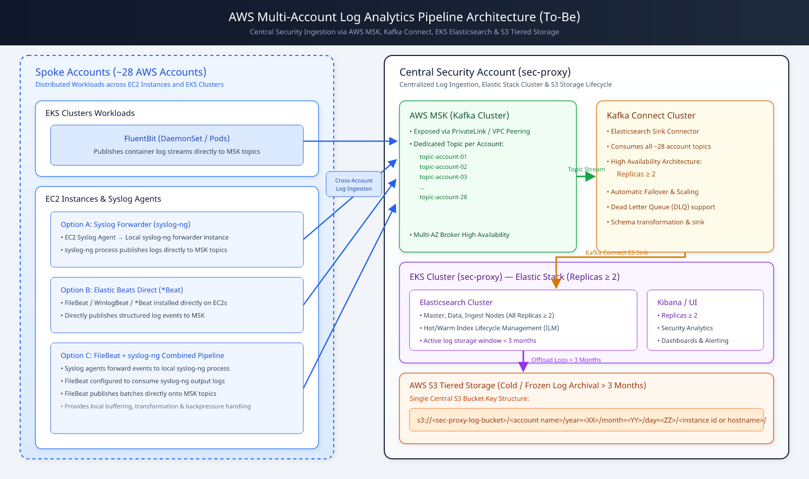
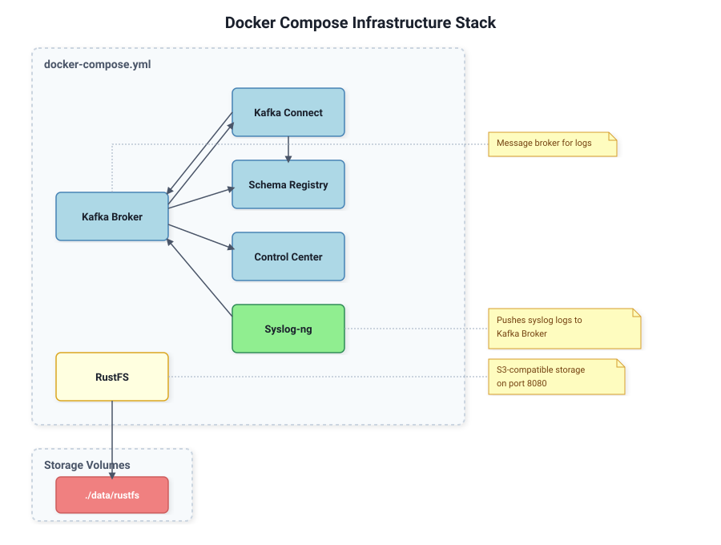
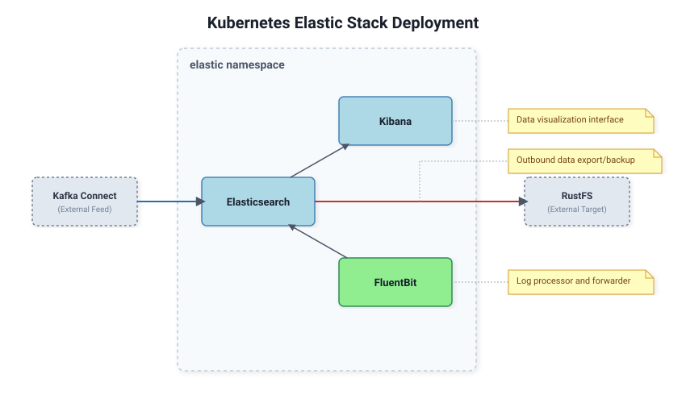
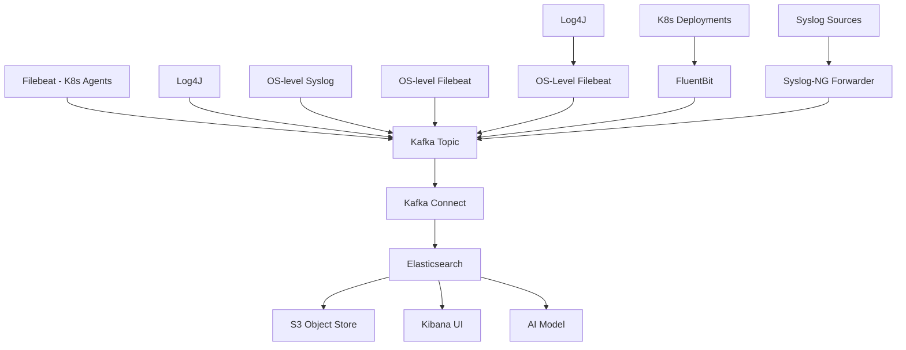
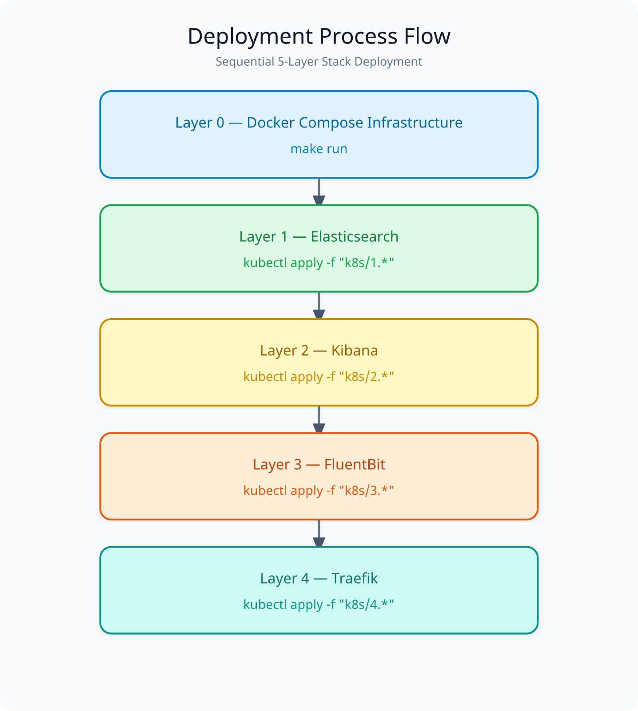

# ElasticSearch Stack Log Analytics Pipeline

This repository contains the complete deployment configuration for an [Elastic Stack](https://www.elastic.co) log analytics pipeline. 

The solution includes [Syslog](https://en.wikipedia.org/wiki/Syslog) forwardig onto [Syslog-ng](https://en.wikipedia.org/wiki/Syslog-ng), [Fluentbit](https://fluentbit.io) and [Filebeat](https://www.elastic.co/beats/filebeat) part of the [Beats framework](https://www.elastic.co/beats) of lightweight data shippers, all configured to publish to [Kafka](https://kafka.apache.org) topics.

Our Topics to be utlise the [Kafka Connect](https://www.confluent.io/lp/confluent-connectors/) framework via Kafka Sink Connector jobs, persisting our log streams into [ElasticSearch](https://www.elastic.co), enabling comprehensive log collection and analysis solution.


Just to make it clear, all of this is being done on my Apple Macbook, and to put it simply, this would be impossible without what [vCluster](https://www.vcluster.com) allows me to do as far as running a local [Kubernetes](https://kubernetes.io) cluster is concerned.

I'm simulating the off cluster supporting services via [Docker Compose](https://docs.docker.com/compose/).

## Architecture Overview

The deployment follows a modern log analytics architecture with the following components:

### Core Stack

- **Elasticsearch**: Distributed search and analytics engine for log storage, little known fact, it's a Vector database at it's core, as such allows for  much wider set of use cases. 
- **Kibana**: Web interface for data visualization and exploration
- **Filebeat**: Lightweight log shipper, for our use case, for Docker Compose host/system logs
- **FluentBit**: Kubernetes-native log collection (pod logs)

### Log Collection

- **Syslog**: Standard syslog protocol support
- **Syslog-ng**: Enhanced syslog implementation with advanced filtering
- **FluentBit**: Kubernetes-native log collection (for containers)
- **OS-level Syslog**: Direct-on-OS syslog collector
- **OS-level Filebeat**: Direct-on-OS Filebeat collector

### Integration Layer

- **Kafka**: Message broker for log ingestion and buffering
- **Kafka Connect**: Connector for Elasticsearch sink integration
- **RustFS**: S3 tiered storage solution for long-term log retention


### Project Git

[Elastic Pipeline Lab](https://github.com/georgelza/ElasticPipelineLab)

---

## Architecture Diagrams

### 1. High-level Architecture



### 2. Docker Compose Infrastructure



### 3. Kubernetes Elastic Stack Deployment



---

## Deployment Flow

### Build Docker Images

Before doing anything execute the following

```bash
# Pull all base images
cd infrastructure
make pull

# Build our Kafka Connect image with Elasticsearch sink connector installed
cd connect
make build
```

This will build all required Docker images including the custom Kafka Connect and RustFS containers needed for proper operation.

### Deployment Order

cd back to the project root at this point.

1. Then run `make run` to start the Docker Compose services
2. Finally run `make k8s` to deploy Kubernetes components

The Docker Compose infrastructure (Kafka, Connect, etc.) must be running before deploying Kubernetes components.

The Below is the world of the possible..., we will be deploying most, except for the various Log4J input feeds and AI Integration consumption.



---

## Deployment Layers



The stack is split into five layers. **Layer 0** runs in Docker Compose on the
host (off-cluster supporting services); **Layers 1–4** are Kubernetes manifests
under `k8s/`, applied by numeric prefix so each layer can be applied (or
updated) independently.

### Layer 0 — Docker Compose infrastructure (`make run`)

Off-cluster supporting services, all on the `elastic` Docker bridge network.
The vcluster pods reach them through **published ports on
`host.docker.internal`** (the Docker Desktop host alias — resolves inside
vcluster pods; no compose bridge IPs are hardcoded in the k8s manifests, a
lab-only pattern — production k8s uses proper network integration).

| Service | Container | Publish | Purpose |
|:--- |:--- |:--- |:--- |
| `broker` | Kafka | `9092/9093` | `logs-prod-nonpci-*` topics (`logs-prod-nonpci-syslog`, `logs-prod-nonpci-filebeat`, `logs-prod-nonpci-fluentbit`, `logs-prod-nonpci-log4j`) |
| `schema-registry` | Confluent Schema Registry | `8081` | Kafka schemas |
| `control-center` | Confluent Control Center | `9021` | Kafka Connect UI |
| `connect` | Kafka Connect | `8083` | ES sink connector (`elasticsearch-sink`) |
| `syslog-ng` | balabit/syslog-ng | `514/601` | UDP/TCP syslog → `logs-prod-nonpci-syslog` (JSON `format-json`) |
| `filebeat` | Elastic Filebeat | – | host logs → `logs-prod-nonpci-filebeat` |
| `rustfs` | RustFS (S3) | `9000` S3 API / `9001` console | snapshot object store (eight classification buckets) |

### Layer 1 — Elasticsearch (`kubectl apply -f "k8s/1.*"`)

| File | Contents |
|:--- |:--- |
| `1.00.elastic-namespace.yaml` | `elastic` namespace |
| `1.01.elastic-storage.yaml` | PVs/PVCs for `es-1` (worker-1) and `es-2` (worker-2) |
| `1.02.elasticsearch.yaml` | ConfigMap (`elasticsearch.yml`, incl. `s3.client.default` endpoint `http://host.docker.internal:9000` / region / path-style), two `Deployment`s (es-1/es-2), Service + headless Service, keystore volume |
| `1.03.es-s3-credentials.yaml` | `es-s3-credentials` (plain reference copy) + `es-s3-keystore` (pre-seeded keystore with `s3.client.default.access_key`/`secret_key`) |
| `1.04.external-services.yaml` | `broker` ExternalName Service → `host.docker.internal:29092` (lets pods resolve the Compose Kafka advertised listener name via in-cluster DNS — no hardcoded IPs) |

> **Why a keystore?** ES 8.13's repository-s3 does **not** read
> `AWS_ACCESS_KEY_ID` / `AWS_SECRET_ACCESS_KEY` env vars (its fallback chain is
> the EC2 instance-metadata provider only). Credentials must be placed in the
> ES keystore, which is mounted read-only into both pods.

### Layer 2 — Kibana (`kubectl apply -f "k8s/2.*"`)

| File | Contents |
|:--- |:--- |
| `2.01.kibana.yaml` | Kibana `Deployment` + Service (`basePath: /kibana`, routed by Traefik) |

### Layer 3 — FluentBit (`kubectl apply -f "k8s/3.*"`)

| File | Contents |
|:--- |:--- |
| `3.01.fluent-bit-config.yaml` | FluentBit config: CRI parser, tail of `/var/log/containers/*.log`, `[OUTPUT] kafka` → `logs-prod-nonpci-fluentbit`, `timestamp → @timestamp` |
| `3.02.fluent-bit-daemonset.yaml` | DaemonSet (broker reached via the `broker` ExternalName Service → `host.docker.internal:29092`, published port) |
| `3.03.fluent-bit-service.yaml` | Metrics service |

### Layer 4 — Traefik (`kubectl apply -f "k8s/4.*"`)

| File | Contents |
|:--- |:--- |
| `4.01.traefik-crds.yaml` | Traefik CRDs (IngressRoute, Middleware, …) |
| `4.02.traefik-rbac.yaml` | RBAC for the `ingress-traefik1` namespace |
| `4.03.traefik-deploy.yaml` | Traefik Deployment/Service (`web:8000`, `websecure:8443`, `traefik:8080`, `metrics:9100`) |
| `4.04.traefik-ingressroutes.yaml` | `strip-elasticsearch` middleware + `elastic-ingress` IngressRoute (`/kibana` → `kibana:5601`, `/elasticsearch` → `elasticsearch:9200`) |

> **Quoted globs required.** Shell-expanded globs are rejected by kubectl
> (`error: Unexpected args`). Always quote the pattern so kubectl expands it:
> `kubectl apply -f "k8s/1.*"`. The Makefile target `make apply-k8s-layer LAYER=n`
> already does this.

---

## Deployment Instructions

### Prerequisites

1. Install Docker, Docker Compose and vCluster
2. Set up vcluster (see vcluster.yml)
3. Ensure proper host networking

### 1. Initialize Kubernetes Cluster

---

## Basic Installation/HOST Preperation

1. Install vCluster

```bash
brew install vcluster

# Upgrade vCluster CLI to the latest version
vcluster upgrade --version v0.36.1

# Set Docker as the default driver
vcluster use driver docker

# Start vCluster Platform (optional but recommended)
vcluster platform start
```

### Creating up Multi Node K8S Cluster on vCluster

- See BUILD.md

```bash
# Deploy vcluster Kubernetes cluster
make k8s
```

### 2. Deploy Docker Compose Infrastructure

```bash
# Start all Docker services including Kafka, Syslog-ng, RustFS
make run
```

### 3. Deploy Kubernetes Elastic Stack

```bash
# Deploy Elasticsearch, Kibana, and Kafka Connect to vcluster
kubectl apply -f k8s/
```

### 4. Configure Log Feeds

Deploy various feed components:

*All Markdown based instructions are in Deployment/*

- Install and configure syslog-ng (DEPLOY_NG_FEED.md)
- Deploy Filebeat components (DEPLOY_FILEBEAT.md)
- Configure OS-level syslog collection (DEPLOY_SYSLOG.md)

---

## Key Features

### 1. Namespace Standardization

All Elastic components deployed in the **elastic** namespace for consistent management:

### 2. Multi-Collector Support

- Filebeat for container logs
- Syslog for traditional log collection  
- Syslog-ng for enhanced parsing and filtering
- FluentBit for Kubernetes-native logging

### 3. OS-level Collection

- Direct-on-OS Syslog collector for system logs
- Direct-on-OS Filebeat collector for application logs
- Both integrated with the same Kafka stack for unified processing

### 4. Scalability

- Elasticsearch: 2-node cluster with local disk storage (`es-1` on worker-1, `es-2` on worker-2)
- Kibana: single-replica Deployment (scalable)
- FluentBit: DaemonSet for full node coverage (k8s pod logs); Filebeat runs as a Compose service (host logs)

### 5. Storage Integration

- Local storage for active logs
- S3 tiered storage via RustFS for long-term retention
- Configurable retention policies (3+ months minimum)

### 6. Security

- Lab deployment: Elasticsearch security is **disabled** (`xpack.security.enabled: false`) — no TLS, plaintext Kafka — as this is a local simulation
- Traefik RBAC is restricted to the `ingress-traefik1` namespace

---

## Usage

1. **Log Collection**: All components automatically begin collecting logs
2. **Dashboard Access**: Access Kibana UI via port 5601
3. **Data Analysis**: Create visualizations in Kibana 
4. **Monitoring**: Use built-in logs to track system health

---

## macOS Setup Scripts

Our Lab is currently hosted on a Apple MAC, as such we'll be deploying filebeat locally and integrating with the native syslog service.

We provide automated scripts to configure macOS syslog and Filebeat to send logs to our Docker Compose infrastructure:

### Syslog Setup

```bash
./scripts/setup_macos_syslog.sh
```

This script configures macOS syslog to forward logs to Docker Compose syslog-ng at **localhost:514**.

### Filebeat Setup  

```bash
./scripts/setup_macos_filebeat.sh
```

This script configures macOS Filebeat to forward logs to Docker Compose Kafka at **localhost:9092**.

Both scripts require Mac admin privileges to execute and will:

- Install necessary components (if missing)
- Configure logging to forward to Docker Compose services
- Start the required services

---

## Docker Compose Filebeat

We also provide a Filebeat service within the Docker Compose stack that can collect logs from the host system and forward them to Kafka:

```yaml
filebeat:
  image: docker.elastic.co/beats/filebeat:8.14.0
  container_name: filebeat
  hostname: filebeat
  user: root
  command: filebeat -e -c /etc/filebeat/filebeat.yml
  volumes:
    - ./data/filebeat/config/filebeat.yml:/etc/filebeat/filebeat.yml
    - /var/log:/var/log
    - /var/lib/docker/containers:/var/lib/docker/containers
  depends_on:
    - broker
  healthcheck:
    test: ["CMD-SHELL", "filebeat test config -e"]
    interval: 30s
    timeout: 10s
    retries: 3
```

The Filebeat service in Docker Compose will:

- Collect logs from `/var/log` and Docker container logs
- Forward logs to the Kafka broker at `broker:29092`
- Use the topic `logs-prod-nonpci-filebeat`

For detailed configuration and setup instructions, see [DEPLOY_FILEBEAT_DOCKER.md](DEPLOY_FILEBEAT_DOCKER.md).

---

## Security Considerations

- **Lab-only posture:** Elasticsearch runs with security **disabled**
  (`xpack.security.enabled: false`, see `k8s/1.02.elasticsearch.yaml`) and Kafka
  is plaintext — this is a local simulation, not a hardened deployment
- RBAC is limited to the Traefik layer (`k8s/4.02.traefik-rbac.yaml`)
- No NetworkPolicies or TLS are deployed; add them before any production use

## S3 Storage Configuration

The system organizes snapshot data by security-classification **AWS account**:
the S3 bucket name maps 1:1 to the source AWS account name (a "set of
information/systems aligned and managed together" financially / governance
wise) and the Elasticsearch snapshot repository shares the **same name** as the
bucket. The account template holds eight classifications (`prod-pci`,
`prod-nonpci`, `prod-unregulated`, `prod-ife`, `nonprod-pci`, `nonprod-nonpci`,
`nonprod-unregulated`, `nonprod-ife`); log feeds carry the account in the topic
name (`logs-prod-nonpci-*` = simulated `prod-nonpci` account). See
`scripts/configure_s3_snapshots.sh` and `Deployment/DATASETS.md`.

Directory structure (inside each bucket; `<project name>` is the FIRST path
element, date segments are zero-padded — `year=yyyy`, `month=mm`, `day=dd`):

```
<S3 endpoint>/<project name = log_analytics>/<bucket == aws account name>/year=yyyy/month=mm/day=dd/<instanceId or Hostname>
```

Configuration parameters (repo-root `.env`; consumed by
`scripts/configure_s3_snapshots.sh` — the S3 client credentials are also baked
into the ES keystore in `k8s/1.03.es-s3-credentials.yaml`):

- `S3_ENDPOINT`: The S3 endpoint URL (lab: `http://s3.amazonaws.com` legacy value — the live stack talks to RustFS at `http://127.0.0.1:9000` via `RUSTFS_ENDPOINT`)
- `S3_PROJECT_NAME`: Project identifier — first path element (`log_analytics`)
- `S3_AWS_ACCOUNT_NAME` / `S3_BUCKET_NAME`: legacy values (`sec-proxy` / `payinc`) — the actual buckets and snapshot repositories are named after the eight account classifications (see above); log feeds use `logs-<account>-*` topic naming
- `S3_REGION`: AWS region (`af-south-1`)

## Kibana

Kibana runs in the vcluster (`k8s/2.01.kibana.yaml`) served under
`server.basePath: /kibana` and fronted by the Traefik `/kibana` route (see
`Deployment/TRAEFIK.md`). Per-feed data views, saved searches, visualizations
and **dashboards for the three log feeds** (syslog / filebeat / fluentbit) are
provisioned as code:

```bash
make deployk8s            # includes: make elastic-setup + make kibana-dashboards ...
make kibana-dashboards    # re-run anytime (idempotent) — per-feed dashboards
make snapshot             # ad-hoc snapshot of logs-prod-nonpci-* → prod-nonpci
```

End-to-end integration steps, the Saved Objects API and troubleshooting are
documented in `Deployment/DEPLOY_KIBANA.md`.

All S3 credentials are stored in environment variables and should be managed
securely (the ES side uses a pre-seeded keystore — see
`k8s/1.03.es-s3-credentials.yaml`). The actual storage folder structure is
implemented by the RustFS service according to the defined naming convention.

---

## Maintenance

### Updates

Regular update of base images and configurations through configured automation.

### Monitoring

- Elasticsearch cluster health metrics
- Kibana accessibility 
- Log forwarding success rates
- Storage utilization monitoring

### Scaling

All components support horizontal scaling as per their architectural design.

---

## Contributing

This repository provides a complete, production-ready deployment solution. For enhancements or bug fixes:

1. Fork the repository
2. Create a feature branch
3. Make changes
4. Submit a pull request

---

## License

This project is licensed under the MIT License - see the LICENSE file for details.

## Support

For support or questions, please refer to:

- `DEPLOY_ELASTIC.md`: Complete Kubernetes/Docker deployment documentation
- `DEPLOY_KIBANA.md`: Kibana ↔ Elasticsearch integration, dashboards & Saved Objects API
- `DEPLOY_*.md`: Detailed component deployment instructions
- Existing comments in all configuration files

---

## Misc useful commands

Should you need to restart you host environment.

The following is the commands I executed to bring my cluster/s back up after having restarted Docker

- `vcluster use driver docker`

- `vcluster platform start`

- `vcluster resume my-vc1`

or

`docker restart $(docker ps -q --filter "name=my-vc1")`


You can of course also stop/pause a running cluster:

- `vcluster pause my-vc1`

To apply changes to a previously created cluster.

- `vcluster create --upgrade <cluster-name> -f vcluster.yml`

Tear Down
  
- `vcluster delete <cluster-name>`

---

## Project Pages

- [VIND](https://github.com/loft-sh/vind)

- [vCluster](https://github.com/loft-sh/vcluster)

- [Full Quickstart Guide](https://www.vcluster.com/docs/vcluster/#deploy-vcluster)

- [Slack Seerver](https://slack.loft.sh/)

**THE END**

And like that we’re done with our little trip down another Rabbit Hole, Till next time.

Thanks for following. 

### The Rabbit Hole


---

## ABOUT ME

I’m a techie, a technologist, always curious, love data, have for as long as I can remember always worked with data in one form or the other, Database admin, Database product lead, data platforms architect, infrastructure architect hosting databases, backing it up, optimizing performance, accessing it. Data data data… it makes the world go round.
In recent years, pivoted into a more generic Technology Architect role, capable of full stack architecture.

### By: George Leonard

- georgelza@gmail.com
- https://www.linkedin.com/in/george-leonard-945b502/
- https://medium.com/@georgelza


