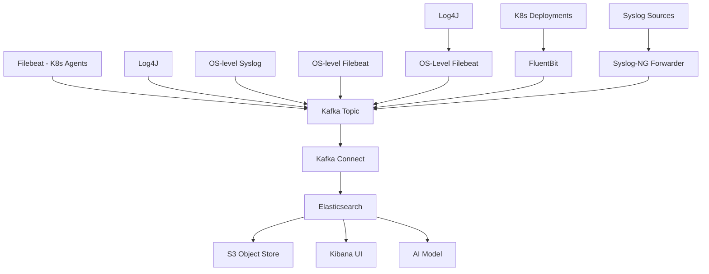

# ElasticSearch Stack Log Analytics Pipeline

This repository contains the complete deployment configuration for an [Elastic Stack](https://www.elastic.co) log analytics pipeline. 

The solution includes [Syslog](https://en.wikipedia.org/wiki/Syslog) forwardig onto [Syslog-ng](https://en.wikipedia.org/wiki/Syslog-ng), [Fluentbit](https://fluentbit.io) and [Filebeat](https://www.elastic.co/beats/filebeat) part of the [Beats framework](https://www.elastic.co/beats) of lightweight data shippers, all configured to publish to [Kafka](https://kafka.apache.org) topics.

Our Topics to be utlise the [Kafka Connect](https://www.confluent.io/lp/confluent-connectors/) framework via Kafka Sink Connector jobs, persisting our log streams into [ElasticSearch](https://www.elastic.co), enabling comprehensive log collection and analysis solution.

For Lab purposes we're deploying everything onto [Docker Compose](https://docs.docker.com/compose/) and a [Kubernetes](https://kubernetes.io) environment hosted on a [vCluster](https://www.vcluster.com) stack via VIND

## Architecture Overview

The deployment follows a modern log analytics architecture with the following components:

### Core Stack

- **Elasticsearch**: Distributed search and analytics engine for log storage, little known fact, it's a Vector database at it's core, as such allows for  much wider set of use cases. 
- **Kibana**: Web interface for data visualization and exploration
- **Filebeat**: Lightweight log shipper, for our use case, for Kubernetes pod logs

### Log Collection

- **Syslog**: Standard syslog protocol support
- **Syslog-ng**: Enhanced syslog implementation with advanced filtering
- **FluentBit**: Kubernetes-native log collection (for containers)
- **OS-level Syslog**: Direct-on-OS syslog collector
- **OS-level Filebeat**: Direct-on-OS Filebeat collector

### Integration Layer

- **Kafka**: Message broker for log ingestion and buffering
- **Kafka Connect**: Connector for Elasticsearch sink integration
- **RustFS**: S3 tiered storage solution for long-term log retention


### Project Git

[Elastic Pipeline Lab](https://github.com/georgelza/ElasticPipelineLab)

---

## Deployment Flow

The Below is the world of the possible..., we will be deploying most, except for the various Log4J input feeds and AI Integration consumption.



---

## Architecture Diagrams

### 1. High-level Architecture


### 2. Docker Compose Infrastructure


### 3. Kubernetes Elastic Stack Deployment


--- 

## Deployment Instructions

### Prerequisites

1. Install Docker, Docker Compose and vCluster
2. Set up vcluster (see vcluster.yml)
3. Ensure proper host networking

### 1. Initialize Kubernetes Cluster

---

## Basic Installation/HOST Preperation

1. Install vCluster

```bash
brew install vcluster

# Upgrade vCluster CLI to the latest version
vcluster upgrade --version v0.36.1

# Set Docker as the default driver
vcluster use driver docker

# Start vCluster Platform (optional but recommended)
vcluster platform start
```

### Creating up Multi Node K8S Cluster on vCluster

- See BUILD.md

```bash
# Deploy vcluster Kubernetes cluster
make k8s
```

### 2. Deploy Docker Compose Infrastructure

```bash
# Start all Docker services including Kafka, Syslog-ng, RustFS
make run
```

### 3. Deploy Kubernetes Elastic Stack

```bash
# Deploy Elasticsearch, Kibana, and Kafka Connect to vcluster
kubectl apply -f k8s/
```

### 4. Configure Log Feeds

Deploy various feed components:

*All Markdown based instructions are in Deployment/*

- Install and configure syslog-ng (DEPLOY_NG_FEED.md)
- Deploy Filebeat components (DEPLOY_FILEBEAT.md)
- Configure OS-level syslog collection (DEPLOY_SYSLOG.md)

---

## Key Features

### 1. Namespace Standardization

All Elastic components deployed in the **elastic** namespace for consistent management:

### 2. Multi-Collector Support

- Filebeat for container logs
- Syslog for traditional log collection  
- Syslog-ng for enhanced parsing and filtering
- FluentBit for Kubernetes-native logging

### 3. OS-level Collection

- Direct-on-OS Syslog collector for system logs
- Direct-on-OS Filebeat collector for application logs
- Both integrated with the same Kafka stack for unified processing

### 4. Scalability

- Elasticsearch: 3+ node cluster with proper disk storage
- Kibana: 2+ replica deployment
- Filebeat: DaemonSet for full node coverage

### 5. Storage Integration

- Local storage for active logs
- S3 tiered storage via RustFS for long-term retention
- Configurable retention policies (3+ months minimum)

### 6. Security

- Elasticsearch security with authentication
- Network policies for internal communication
- TLS support for transmission security

---

## Usage

1. **Log Collection**: All components automatically begin collecting logs
2. **Dashboard Access**: Access Kibana UI via port 5601
3. **Data Analysis**: Create visualizations in Kibana 
4. **Monitoring**: Use built-in logs to track system health

---

## macOS Setup Scripts

We provide automated scripts to configure macOS syslog and Filebeat to send logs to our Docker Compose infrastructure:

### Syslog Setup

```bash
./scripts/setup_macos_syslog.sh
```

This script configures macOS syslog to forward logs to Docker Compose syslog-ng at **localhost:514**.

### Filebeat Setup  

```bash
./scripts/setup_macos_filebeat.sh
```

This script configures macOS Filebeat to forward logs to Docker Compose Kafka at **localhost:9092**.

Both scripts require Mac admin privileges to execute and will:

- Install necessary components (if missing)
- Configure logging to forward to Docker Compose services
- Start the required services

---

## Docker Compose Filebeat

We also provide a Filebeat service within the Docker Compose stack that can collect logs from the host system and forward them to Kafka:

```yaml
filebeat:
  image: docker.elastic.co/beats/filebeat:8.14.0
  container_name: filebeat
  hostname: filebeat
  command: filebeat -e -c /etc/filebeat/filebeat.yml
  volumes:
    - ./conf/filebeat.yml:/etc/filebeat/filebeat.yml
    - /var/log:/var/log
    - /var/lib/docker/containers:/var/lib/docker/containers
  depends_on:
    - broker
  networks:
    - elastic
```

The Filebeat service in Docker Compose will:

- Collect logs from `/var/log` and Docker container logs
- Forward logs to the Kafka broker at `broker:29092`
- Use the topic `filebeat-logs`

For detailed configuration and setup instructions, see [DEPLOY_FILEBEAT_DOCKER.md](DEPLOY_FILEBEAT_DOCKER.md).

---

## Security Considerations

- All services use secure communication channels
- Authentication enabled for Elastic components
- RBAC policies to limit access
- Network policies to restrict inter-service communication

---

## Maintenance

### Updates

Regular update of base images and configurations through configured automation.

### Monitoring

- Elasticsearch cluster health metrics
- Kibana accessibility 
- Log forwarding success rates
- Storage utilization monitoring

### Scaling

All components support horizontal scaling as per their architectural design.

---

## Contributing

This repository provides a complete, production-ready deployment solution. For enhancements or bug fixes:

1. Fork the repository
2. Create a feature branch
3. Make changes
4. Submit a pull request

---

## License

This project is licensed under the MIT License - see the LICENSE file for details.

## Support

For support or questions, please refer to:

- `DEPLOY_ELASTIC.md`: Complete Kubernetes/Docker deployment documentation
- `DEPLOY_*.md`: Detailed component deployment instructions
- Existing comments in all configuration files

---

## Misc useful commands

Should you need to restart you host environment.

The following is the commands I executed to bring my cluster/s back up after having restarted Docker

- `vcluster use driver docker`

- `vcluster platform start`

- `vcluster resume my-vc1`

or

`docker restart $(docker ps -q --filter "name=my-vc1")`


You can of course also stop/pause a running cluster:

- `vcluster pause my-vc1`

To apply changes to a previously created cluster.

- `vcluster create --upgrade <cluster-name> -f vcluster.yml`

Tear Down
  
- `vcluster delete <cluster-name>`

---

## Project Pages

- [VIND](https://github.com/loft-sh/vind)

- [vCluster](https://github.com/loft-sh/vcluster)

- [Full Quickstart Guide](https://www.vcluster.com/docs/vcluster/#deploy-vcluster)

- [Slack Seerver](https://slack.loft.sh/)

**THE END**

And like that we’re done with our little trip down another Rabbit Hole, Till next time.

Thanks for following. 

### The Rabbit Hole


---

## ABOUT ME

I’m a techie, a technologist, always curious, love data, have for as long as I can remember always worked with data in one form or the other, Database admin, Database product lead, data platforms architect, infrastructure architect hosting databases, backing it up, optimizing performance, accessing it. Data data data… it makes the world go round.
In recent years, pivoted into a more generic Technology Architect role, capable of full stack architecture.

### By: George Leonard

- georgelza@gmail.com
- https://www.linkedin.com/in/george-leonard-945b502/
- https://medium.com/@georgelza


